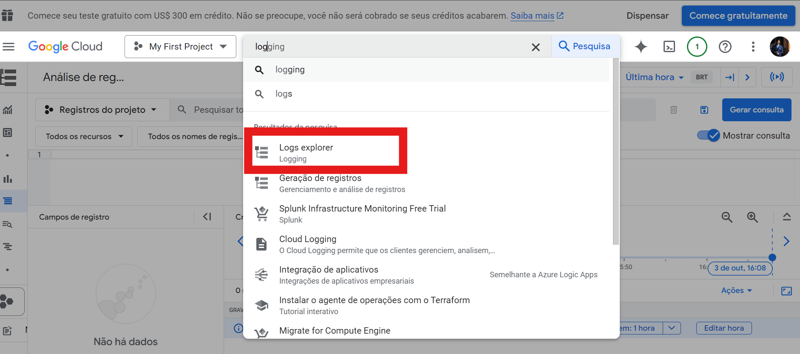
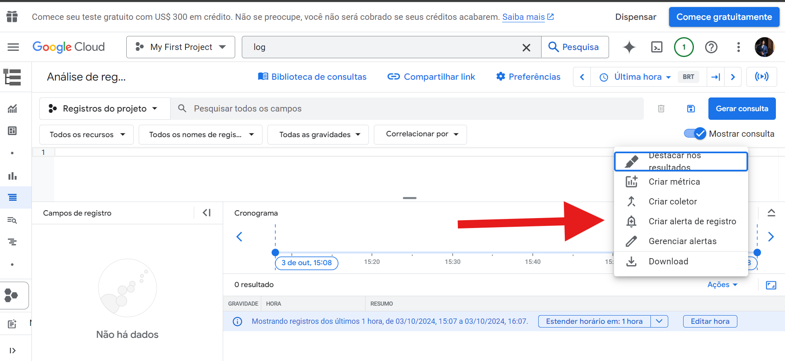
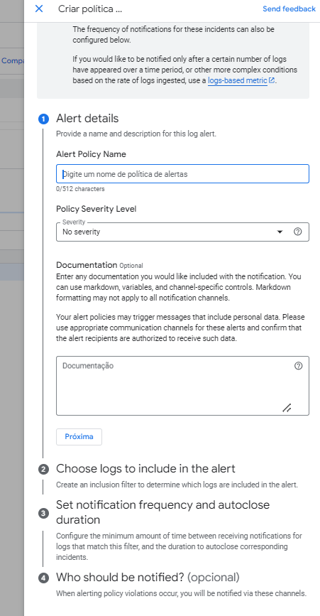
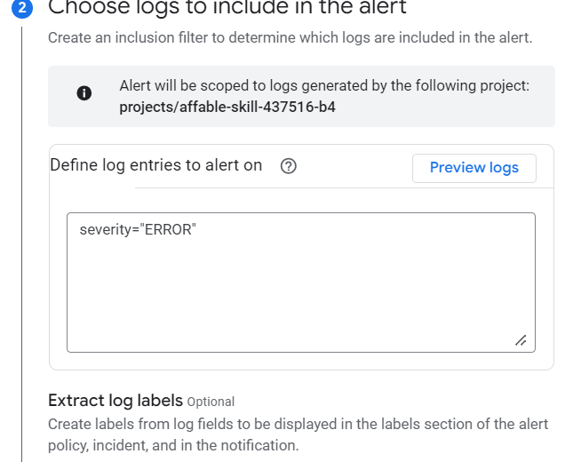
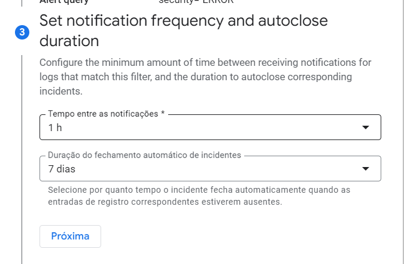
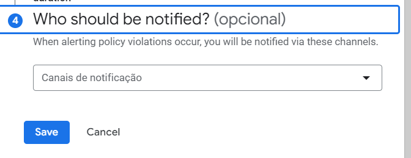

# Alerta

- Criação por Log

## Criação por log a seguir:

- 1 - Acessar logs explorer na barra de pesquisa do gcp.
- 2 - Selecionar o Criar Alerta.

- 3 Logo após uma nova aba lateral será exibida para a criação da política do alerta:

    Temos o Nome do alerta/ Nível de alerta/ Documentação do alerta.

    

    No filtro de registro inserir severity="ERROR".

- 4 Definir detalhes do alerta e insirir as entradas de logs que serão monitoradas:

- 5 Aqui é para adicionar o tags para fornecer mais detalhes  que originou o alerta

- 6 Selecionar o tempo de notoficação e o tempo defechamento automatico do alerta.

- 7 Criar a notificação para o email, sms, ou outro meio de comunicação.

